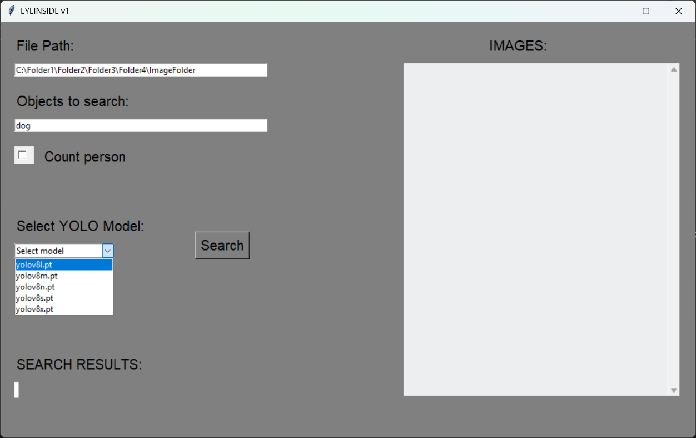
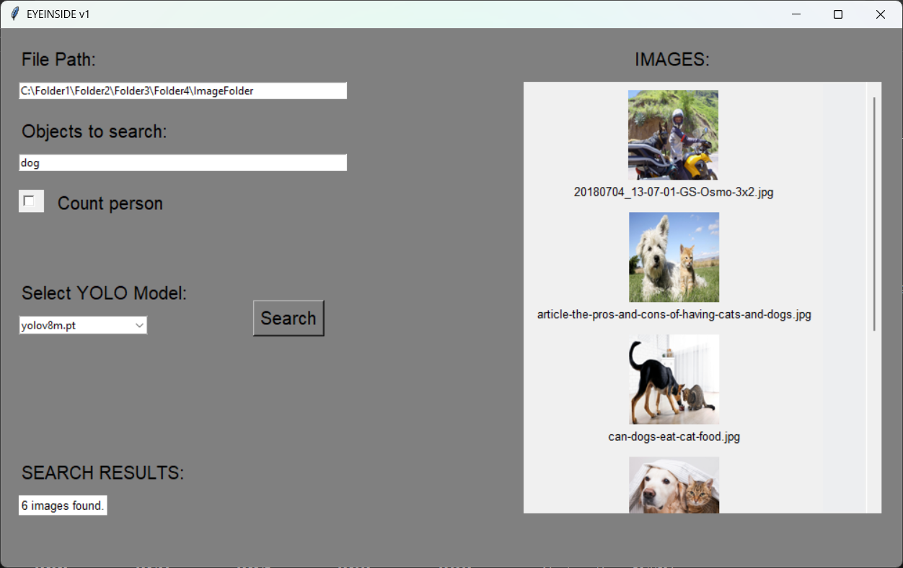
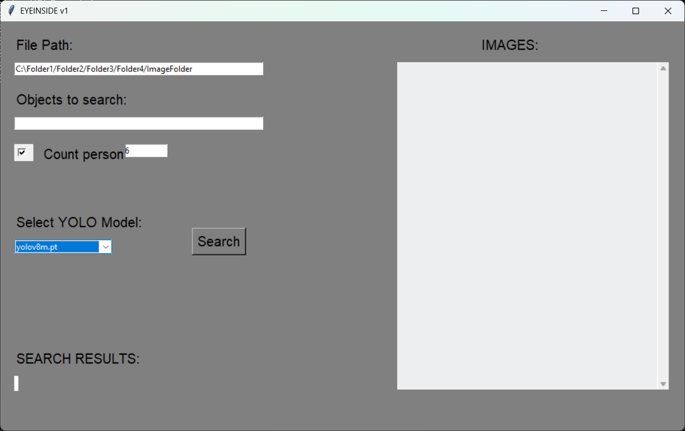

*Download EyeInside [now](https://github.com/oguz81/EyeInsideV1/releases) for Windows.*
-
# EyeInside
An Image Search Engine based on YOLO.

**WHAT IS EYEINSIDE?**

EyeInside is a YOLO-based image search engine. EyeInside looks for what you search for in image files i.e jpg and png files and then shows you images which it finds.

EyeInside also can count number of people in an image. You can click "Count person" box and enter the number to the number box. Then EyeInside looks at images, counts number of person on each imagess and finally gives you the image that includes the number, that you enter, of the person.

**HOW TO USE**
1. Write the path of the folder, which includes images that you want to look at, into the "File Path".

2. Write the object name that you look for.

3. Select YOLO model that you want to run.

4. Press the "Search" Button

If you want to search for an image which includes a certain number of person, click the "Count Person" tickbox and then enter the number.

